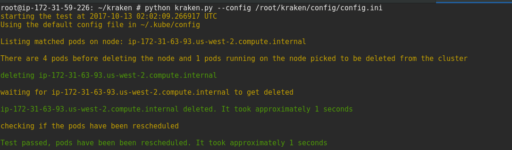

# kraken
Resiliency tool for openshift

### Install the dependencies
```
$ pip install --upgrade setuptools
$ pip install -r requirements.txt
```

## Scenarios covered
### Node goes offline
When a node goes offline or get's deleted, the tool checks if the pods running on the node are rescheduled on some other node. 


### Label master, worker nodes
- Master node needs to be labeled with node_type=master so that the tool doesn't delete the master which will cause problems when we don't have a high availability cluster.
- Worker nodes needs to be labeled with node_type=kraken, kraken looks for that label when picking up the random node to delete.

The labeling can be done by using the openshift-labeler playbook present in the repo or using the oc client like:
```
$ oc label node <node> <label>
$ oc label node <node> node_type=kraken
```

### kraken config
Set the master_label, label with the labels given to the master, worker nodes in the config. For example:
```
[kraken]
master_label: node_type=master
label: type=kraken
```

### Run
```
$ python kraken.py --config config/config.ini  
```

